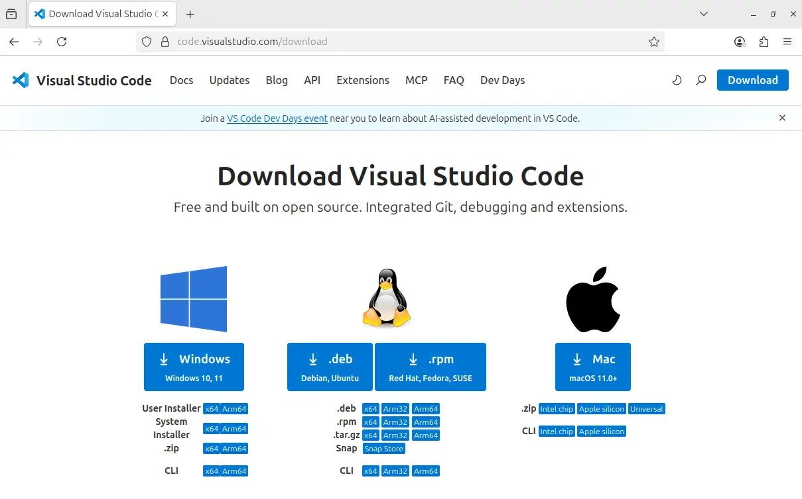

# 🐧 Installing VS Code and Prerequisites – Ubuntu

## Installing VS Code

* Go to the [VS Code download page](code.visualstudio.com/downloads)
* Download and install the Linux version (`.deb` for Ubuntu)
  

> [!WARNING]
> This guide uses the latest LTS version of Ubuntu, 24.04.

* After downloading the file, check its name (referred to as `<file>.deb` below)

* Open the terminal (`CTRL+ALT+T`) and type:<br>

  ```console
  sudo apt install ./<file>.deb
  ```

* After installation, create a folder and try opening VS Code from the terminal:<br>

  ```console
  mkdir tmp
  cd tmp
  code .
  ```

* You should now see the VS Code interface


> [!NOTE]
> VS Code may ask whether you trust the folder’s author. This is important when using `git` repositories, but for now it does not matter. Click “Yes.”

## Installing prerequisites

To **install** and configure the ESP-IDF toolchain, you need to have Python and git already installed.

### Python

To install the ESP-IDF toolchain, Python version `3.12` or higher is required.

To check your Python version:

* Open a terminal (`CTRL+ALT+T`)
* Type `python3 --version`
* On Ubuntu 24.04 you should see something like:

  ```console
  espressif@Ubuntu24:~$ python3 --version
  Python 3.12.3
  ```

So the requirement is satisfied.

> [!NOTE]
> If for some reason it isn’t, you can follow [this guide](https://learnubuntu.com/install-upgrade-python/).

### `git`

ESP-IDF development is based on [`git`](https://git-scm.com/), the version-control tool also used—among others—for Linux kernel development. Git is the foundation on which GitHub is built.

To install git:

* Open a terminal (`CTRL+ALT+T`)

* Update repositories:<br>

  ```
  sudo apt-get update
  ```

* Install `git`:<br>

  ```
  sudo apt-get install git
  ```

* Answer `Y` when prompted:

  ```console
     espressif@Ubuntu24:~$ sudo apt-get install git
     Reading package lists... Done
     Building dependency tree... Done
     Reading state information... Done
     The following additional packages will be installed:
     git-man liberror-perl
     Suggested packages:
     git-daemon-run | git-daemon-sysvinit git-doc git-email git-gui gitk gitweb
     git-cvs git-mediawiki git-svn
     The following NEW packages will be installed:
     git git-man liberror-perl
     0 upgraded, 3 newly installed, 0 to remove and 70 not upgraded.
     Need to get 4,806 kB of archives.
     After this operation, 24.5 MB of additional disk space will be used.
     Do you want to continue? [Y/n]
  ```

* Verify that git was installed correctly:<br>

  ```console
  > git --version
  > git version 2.43.0
  ```

### ESP-IDF prerequisites

To **use** the ESP-IDF toolchain, you need to install some additional tools.

* On Ubuntu, you can install them all with the following command:<br>

  ```bash
  sudo apt-get install git wget flex bison gperf python3 python3-pip python3-venv cmake ninja-build ccache libffi-dev libssl-dev dfu-util libusb-1.0-0
  ```

## Next steps

> Continue with the [next step](README.md#installazione-dellestensione-per-vs-code).
