# Environment Setup Guide

## Introduction

In this guide, we’ll walk through how to set up a development environment for working on projects based on the ESP-IDF toolchain.

We will use the open-source IDE [VS Code](https://code.visualstudio.com/) together with the *ESP-IDF extension for VS Code*, which allows you to configure the toolchain, build projects, and flash Espressif modules.

If you don’t have an Espressif EVK board, you can still follow every step of this guide except the last one.

For the final step, you’ll need an EVK based on any Espressif SoC. During the workshop, you will receive an `ESP32-C3`-based board.

> [!NOTE]
> The term *ESP-IDF* is used both for the actual [toolchain](https://github.com/espressif/esp-idf?tab=readme-ov-file#espressif-iot-development-framework) and for the [VS Code extension](https://github.com/espressif/vscode-esp-idf-extension?tab=readme-ov-file#esp-idf-extension-for-vs-code).
> In this guide:
>
> * *ESP-IDF toolchain* refers to the framework itself
> * *ESP-IDF extension* refers to the VS Code plugin

This guide is divided into 5 parts:

1. Installing VS Code and prerequisites
2. Installing the ESP-IDF extension for VS Code
3. Configuring the ESP-IDF toolchain
4. Building your first project
5. Flashing the module


## Installing VS Code and prerequisites

This step depends on your operating system. Follow the appropriate guide below:

* 🐧 Linux: [Installing VS Code and prerequisites](Installation_linux.md)
* 🪟 Windows: [Installing VS Code](Installation_windows.md)
* 🍎 macOS: [Installing VS Code and prerequisites](Installation_macos.md)


## Installing the ESP-IDF extension for VS Code

Once all prerequisites are installed, we can add the ESP-IDF extension to VS Code. Through the ESP-IDF *extension*, we will then install and configure the *ESP-IDF toolchain*.

* Open VS Code
* Click the **Extensions** icon (four squares) on the left
  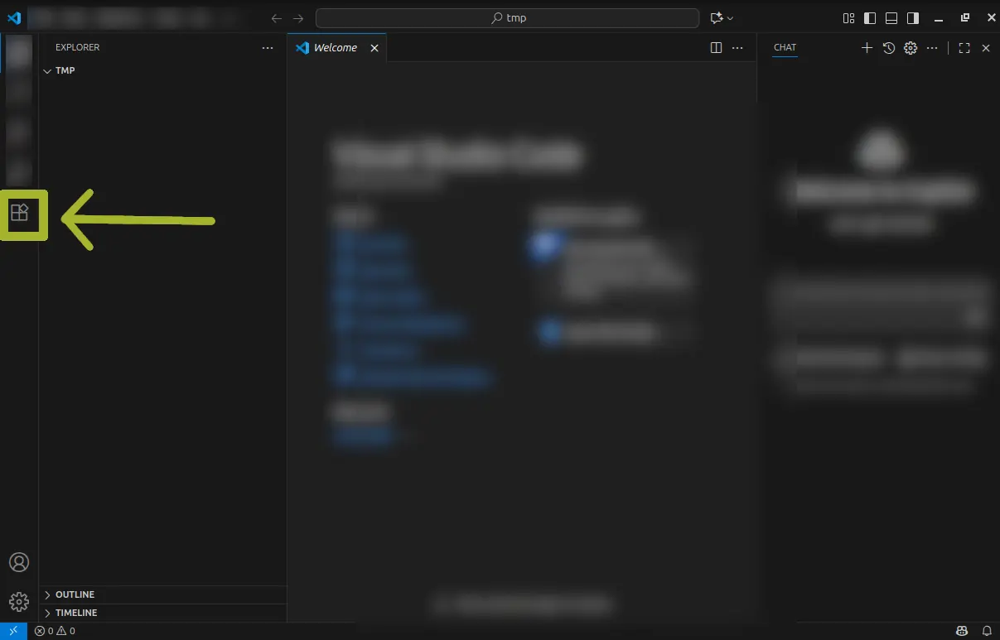
* Search for `esp-idf`
  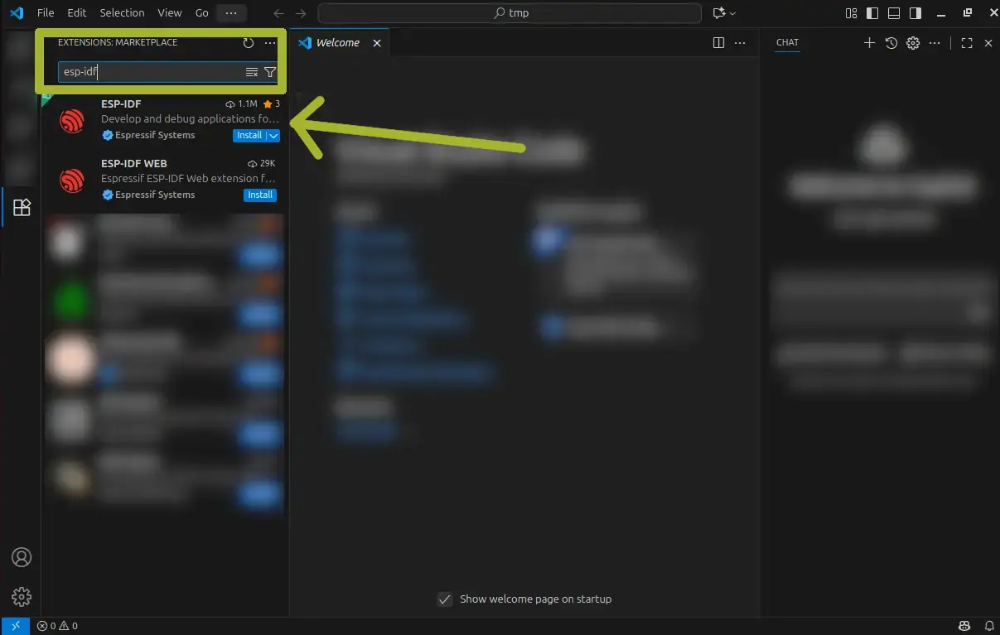
* Click **Install** on the first result, labeled `ESP-IDF`

  * If prompted, click **Accept and Install**


## Configuring the ESP-IDF toolchain

After installing the ESP-IDF extension, run the configuration procedure that automatically installs the entire ESP-IDF toolchain.

* Click **Configuring the ESP-IDF Extension**
  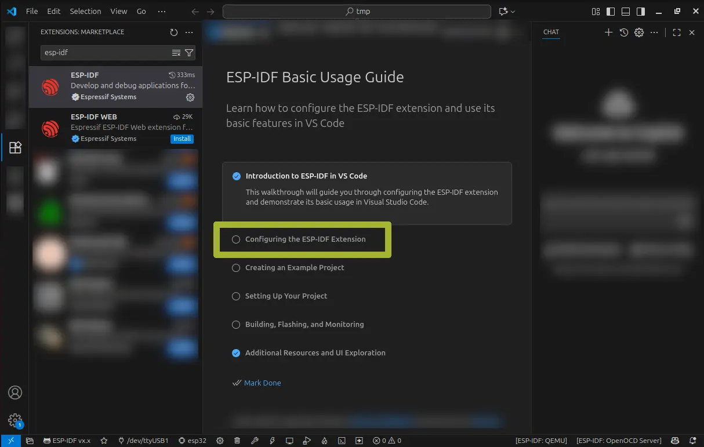

> [!WARNING]
> If the configuration page does not open automatically:
>
> * Open the command palette (`F1` or `CTRL+SHIFT+P`)
> * Type:
>   `> ESP-IDF: Configure ESP-IDF Extension`

* A new tab opens → Click **EXPRESS**
  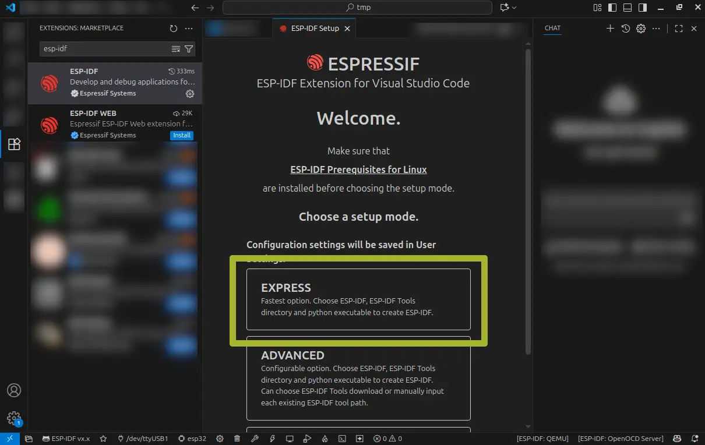
* Open the dropdown **Select ESP-IDF version**
  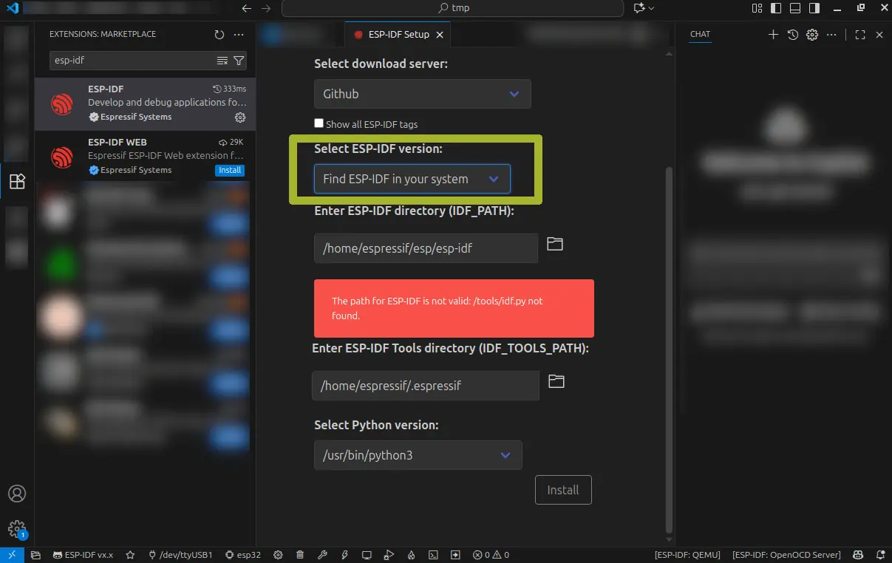
* Select `5.5.1 (release version)`
  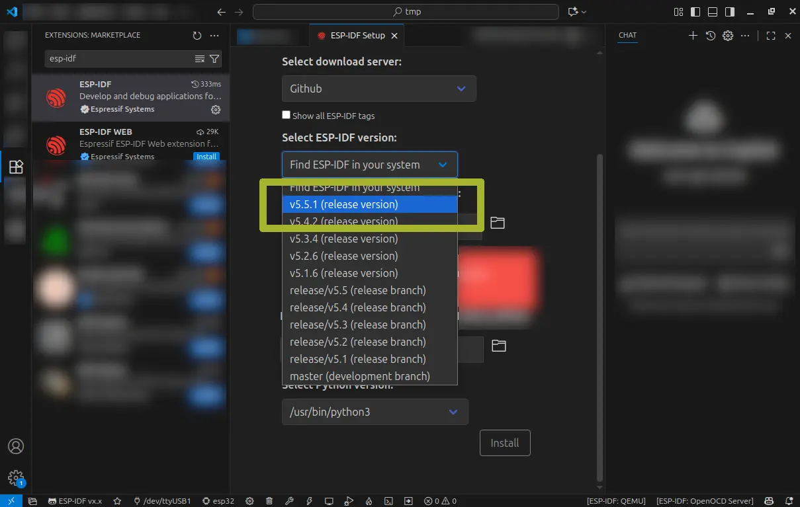
* Click **Install**
  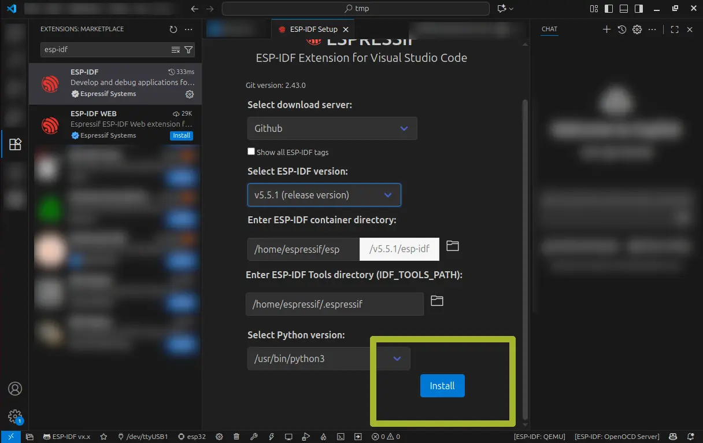
* Wait for the installation to complete
  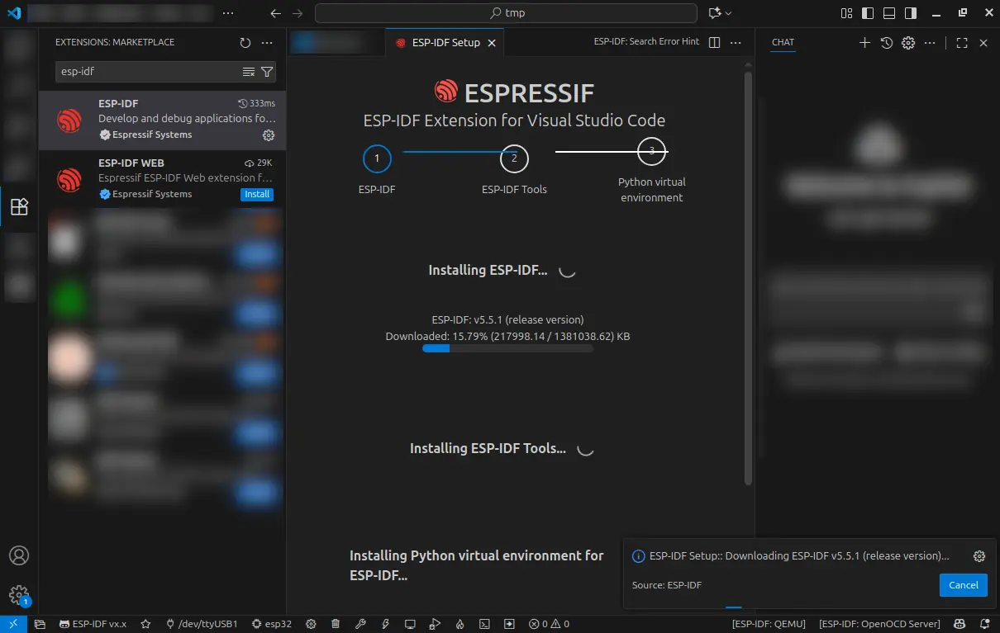

> [!NOTE]
> Installation may take quite some time.

* When complete, you will see the confirmation screen
  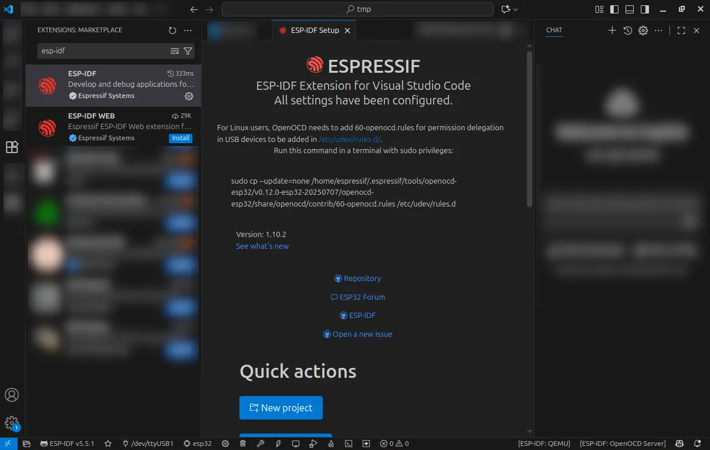


## Building your first project

Once the extension and toolchain are installed, it’s time to test the build system. We’ll create a new project based on one of the ESP-IDF example templates.

### Create a project from an example

* Open the command palette (`F1` or `CTRL+SHIFT+P`)
* Type `ESP-IDF: Show Example Project` and select it
  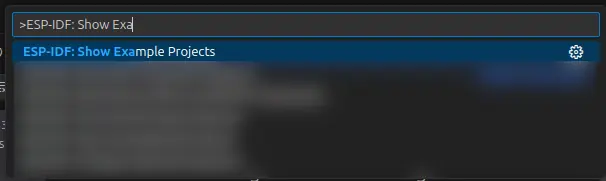
* Choose the version `ESP-IDF v5.5.1`
  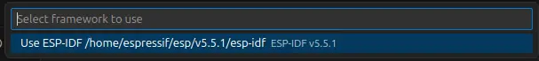
* A tab opens with a list of example projects → Select `hello_world`
  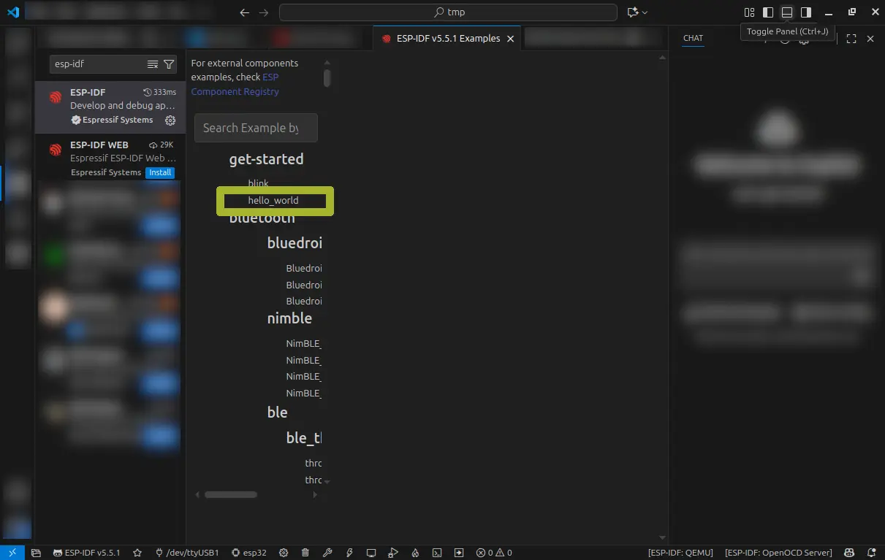
* In the center tab, you’ll see the project description
* Click **Select location for creating hello_world project**
  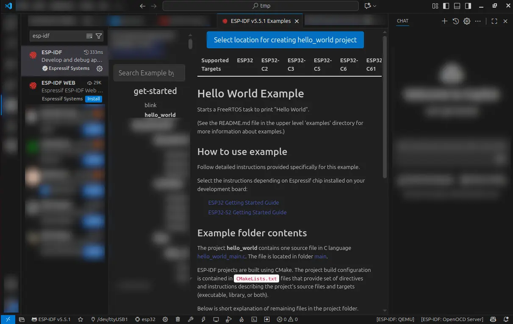
* Choose a folder and click **Select this folder**
* VS Code will open a new window
* On the left, you should now see the files of the `hello_world` project
  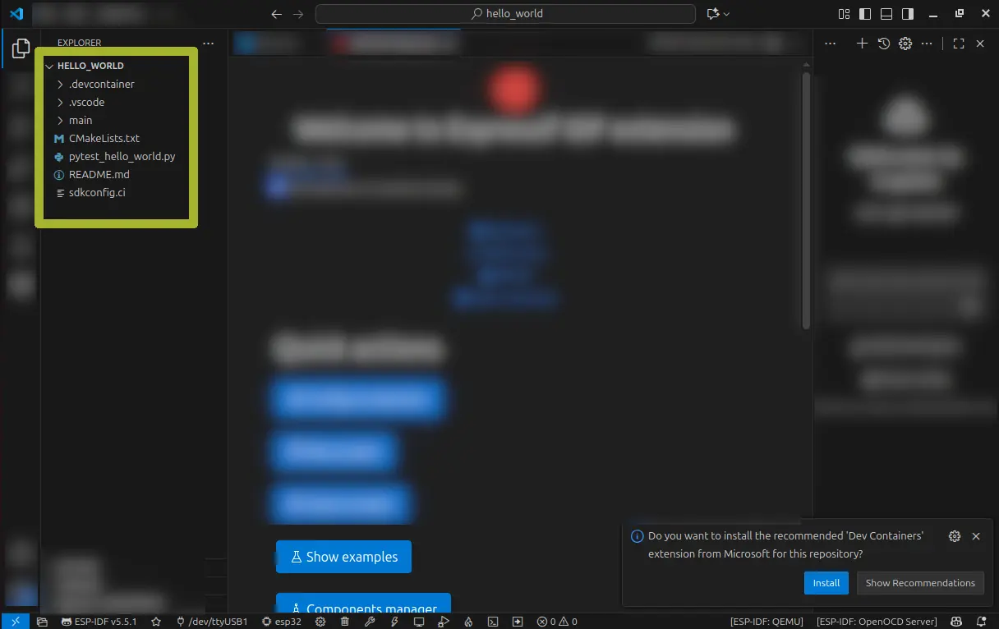

> [!NOTE]
> If you don’t see the files, make sure the first icon (Explorer) is selected.

### Select the target

To build and flash the project, you must specify the target SoC. For this workshop, we’ll use `ESP32-C3`.

> [!TIP]
> If you are using a different EVK, select the corresponding target.

* Open the command palette and type:
  `ESP-IDF: Set Espressif Device Target`
  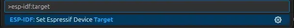
* Select `esp32c3`
  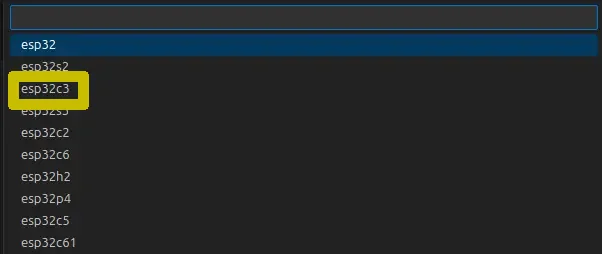
* Then select:
  `ESP32-C3 chip (via builtin USB-JTAG)`
  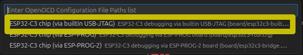

### Build the project

* Open the command palette (`F1` or `CTRL+SHIFT+P`)
* Type: `ESP-IDF: Build Your Project`
  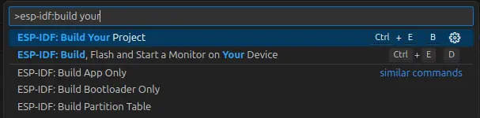
* A terminal will open at the bottom showing build messages
* At the end, you’ll see a memory usage summary
  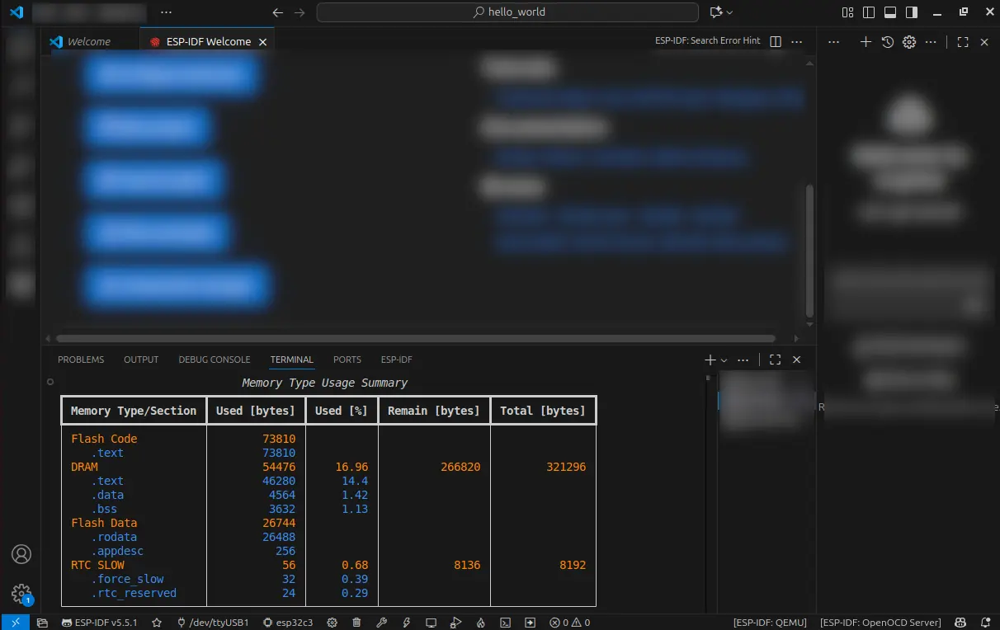

If you see the summary screen, the toolchain and extension are correctly installed.

If you have an EVK available, proceed to the next section to verify USB connectivity.


## Flashing the module

Once the project is built, it’s time to flash it onto the module.
The ESP-IDF extension provides a specific command:

```
> ESP-IDF: Flash (UART) Your Project
```

However, the most commonly used command is:

```
> ESP-IDF: Build, Flash and Start a Monitor on Your Device
```

This command builds the project, flashes it to the device, and starts a serial monitor inside the editor.

To flash the module:

1. Select the EVK’s serial port
2. Run:
   `> ESP-IDF: Build, Flash and Start a Monitor on Your Device`

> [!NOTE]
> On Linux, you may need to add your user to the `dialout` group to access serial ports without admin privileges:
>
> ```console
> sudo usermod -a -G dialout $USER
> ```
>
> Log out and back in for the change to take effect.

### Select the EVK port

* Connect the board to your computer using a USB cable
* If you closed VS Code, reopen it and load the project folder
* Open the command palette and type:
  `> ESP-IDF: Select Port to Use (COM, tty, usbserial)`
  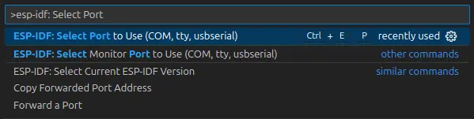
* Select the correct port (usually Silicon Labs)
  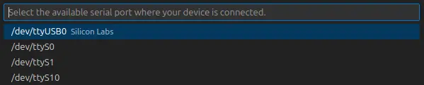
* The port name will now appear in the status bar
  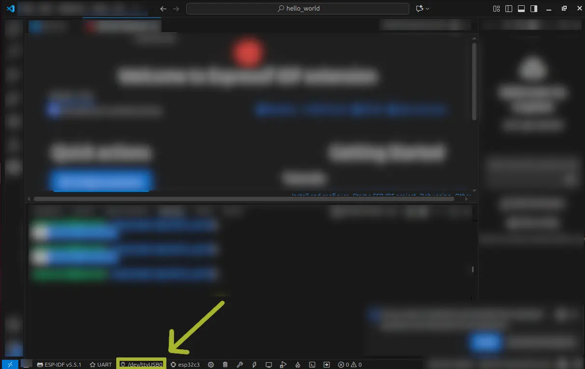

> [!WARNING]
> If your OS does not detect the board automatically, consult the guide for your platform:
>
> * 🪟 [Windows](https://docs.espressif.com/projects/esp-idf/en/stable/esp32/get-started/establish-serial-connection.html#check-port-on-windows)
> * 🐧 [Linux](https://docs.espressif.com/projects/esp-idf/en/stable/esp32/get-started/establish-serial-connection.html#check-port-on-linux-and-macos)
> * 🍎 [macOS](https://docs.espressif.com/projects/esp-idf/en/stable/esp32/get-started/establish-serial-connection.html#check-port-on-linux-and-macos)

### Flash and start the monitor

* Open the command palette and type:
  `> ESP-IDF: Build, Flash and Start a Monitor on Your Device`
  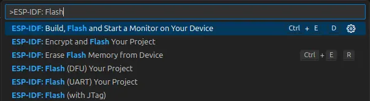
* Choose **UART**
  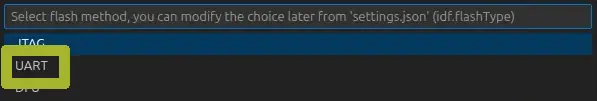
* Wait for flashing to complete and for the monitor to start
* You should see the boot messages and the “hello world!” line
  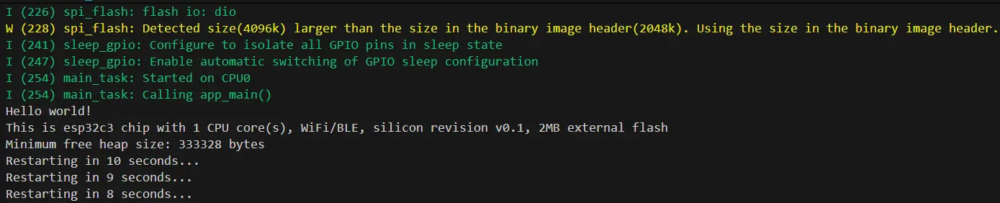

If you see the message in the terminal, your setup is fully operational and you’re ready for the workshop and for developing your own ESP-IDF projects.


## Conclusion

In this guide, we installed VS Code, the ESP-IDF extension, and the ESP-IDF toolchain. We created a project, built it, and flashed it onto the EVK. Your development environment is now ready to use.
