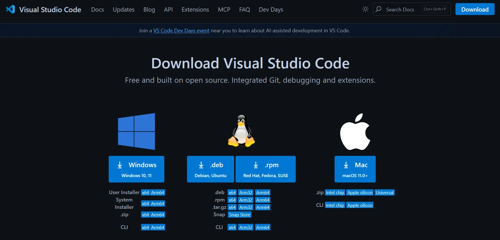
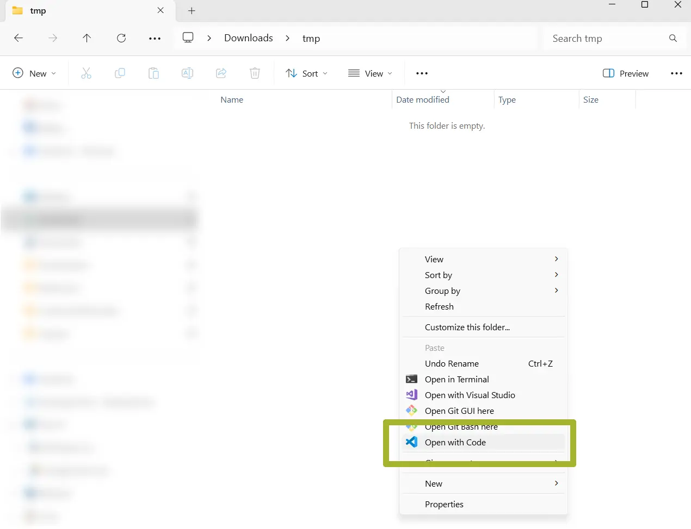
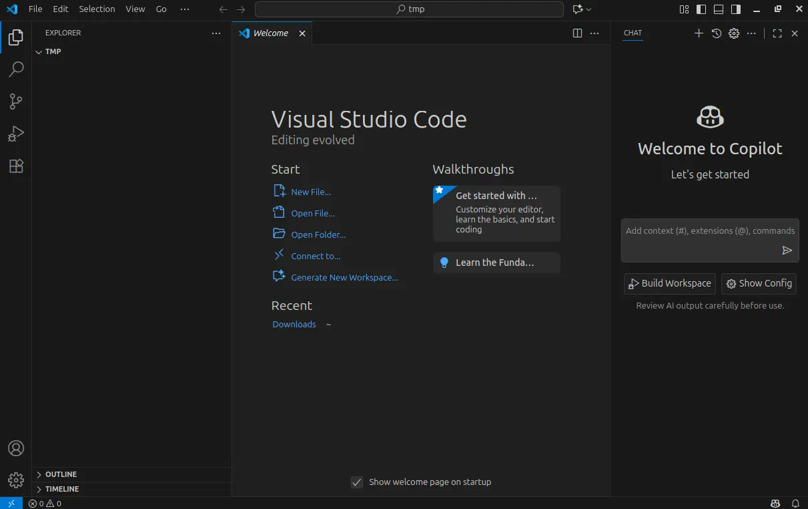

# 🪟 Installing VS Code and Prerequisites – Windows

## Installing VS Code

* Go to the [VS Code download page](https://code.visualstudio.com/download)
* Download and install the Windows version
  

> [!WARNING]
> This guide uses Windows 11.

* After downloading the `.exe` file, double-click it and follow the installation steps.

Once the installation is complete, there are two ways to open VS Code:

1. Open VS Code from the Start menu
2. Open VS Code from a folder

Since it's often useful to open the editor directly inside a directory, we’ll use the second method.

#### Open VS Code from a folder

* Create a new folder named `tmp`

* Right-click inside the folder in File Explorer

* Select **Show more options**

* Click **Open with Code**
  

* You should now see the VS Code interface
  

> [!NOTE]
> VS Code may ask whether you trust the authors of the folder. This matters when working with `git` repositories, but for now it makes no difference. Click **Yes**.

## Installing prerequisites

There are no additional prerequisites to install. These will be handled automatically during the configuration of the ESP-IDF extension.

## Next steps

> Proceed to the [next section](README.md#installazione-dellestensione-per-vs-code).
