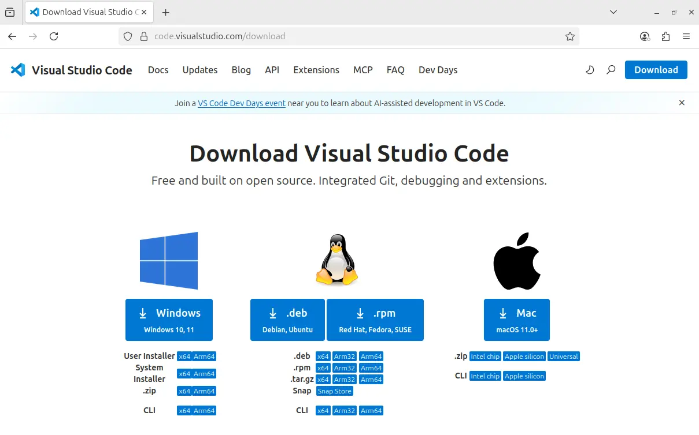

# &#x1F427; Installazione VS Code e prerequisiti - Ubuntu

## Installazione VS Code

* Vai su [sito di download di VS Code](code.visualstudio.com/downloads)
* Scarica ed installa la versione per Linux (`.deb` per Ubuntu)


>[!WARNING]
> In questa guida viene usata l'ultima versione LST di Ubuntu, la 24.04. 

* Una volta scaricato il file, verifica il nome del file (in seguito `<file>.deb`)
* Apri il terminale (`CTRL+ALT+T`) e digita:<br>

   ```console
   sudo apt install ./<file>.deb
   ```

* Finita l'installazione, crea una cartella e prova ad aprire VS Code da terminale:<br>

   ```console
   mkdir tmp
   cd tmp
   code . 
   ```
* Dovresti ora vedere l'interfaccia di VS Code


>[!NOTE]
> VS Code potrebbe chiederti se ti fidi dell'autore della cartella. Questo aspetto è importante quando vengono usate repo `git`, per il momento non fa differenza. Clicca "Sì". 


## Installazione prerequisiti

Per poter __installare__ e configurare la toolchain ESP-IDF, è necessario avere già installati Python e git. 

### Python

Per installare la toolchain ESP-IDF è richiesto una version di python superiore a `3.12`. 

Per verificare la versione di python:

* Apri un terminale (`CTRL+ALT+T`)
* Digita `python3 --version`
* Il risultato in Ubuntu 24.04 è 
    ```console
    espressif@Ubuntu24:~$ python3 --version
    Python 3.12.3
    ```

Quindi il prerequisito è soddisfatto. 

> [!NOTE]
> Se per qualche ragione non lo fosse, puoi seguire [questa guida](https://learnubuntu.com/install-upgrade-python/)

### `git`

Lo sviluppo di ESP-IDF è basato su [`git`](https://git-scm.com/), il tool di controllo di versione usato, tra gli altri, anche per lo sviluppo del kernel Linux. `git` è la base su cui si fonda GitHub. 

Per installare git:
* Apri un terminale (`CTRL+ALT+T`)
* Aggiorna le repository:<br>
   ```
   sudo apt-get update
   ```
* Installa `git`:<br> 
   ```
   sudo apt-get install git
   ```
* Rispondi `Y` quando richiesto:
     ```console
        espressif@Ubuntu24:~$ sudo apt-get install git
        Reading package lists... Done
        Building dependency tree... Done
        Reading state information... Done
        The following additional packages will be installed:
        git-man liberror-perl
        Suggested packages:
        git-daemon-run | git-daemon-sysvinit git-doc git-email git-gui gitk gitweb
        git-cvs git-mediawiki git-svn
        The following NEW packages will be installed:
        git git-man liberror-perl
        0 upgraded, 3 newly installed, 0 to remove and 70 not upgraded.
        Need to get 4,806 kB of archives.
        After this operation, 24.5 MB of additional disk space will be used.
        Do you want to continue? [Y/n] 
     ```
* Controlla che git sia stato installato correttamente:<br>
  ```console
  > git --version
  > git version 2.43.0
  ```

### ESP-IDF prerequisiti

Per __utilizzare__ la toolchain ESP-IDF, è necessario installare alcuni tool addizionali. 

* In Ubuntu, puoi digitare il comando seguente per installarli tutti:<br>
   ```bash
   sudo apt-get install git wget flex bison gperf python3 python3-pip python3-venv cmake ninja-build ccache libffi-dev libssl-dev dfu-util libusb-1.0-0
   ```

## Prossimi step

> Prosegui con il [prossimo passo](README.md#installazione-dellestensione-per-vs-code).
