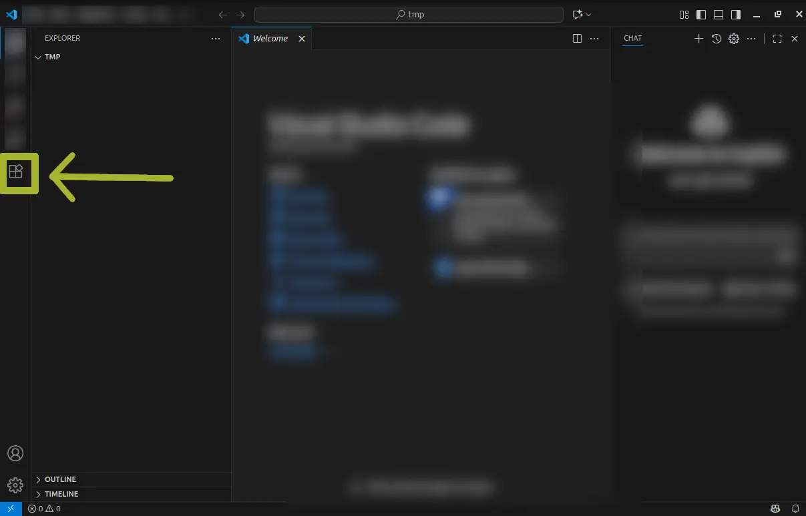
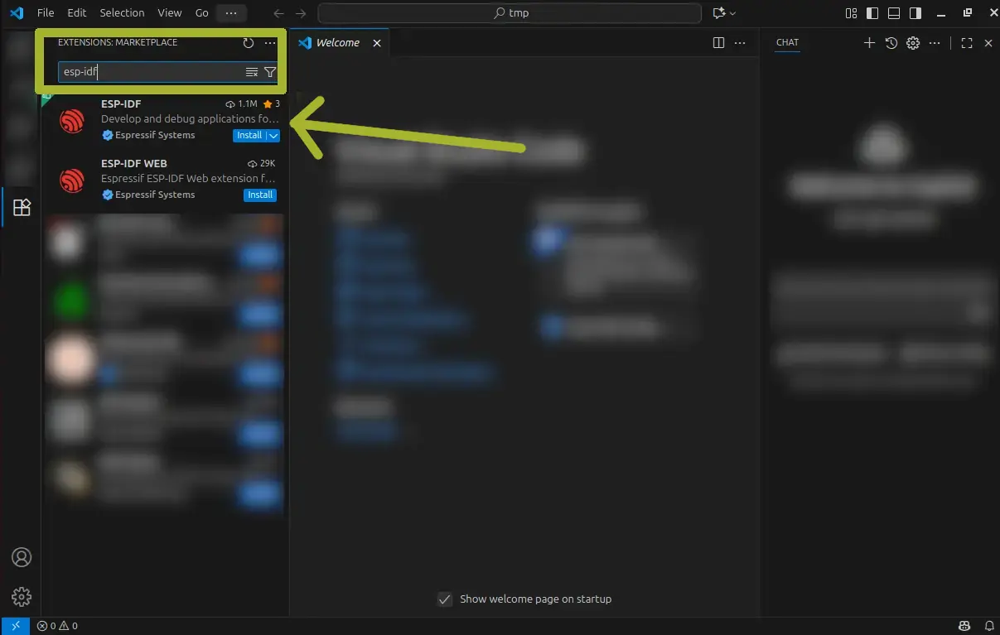
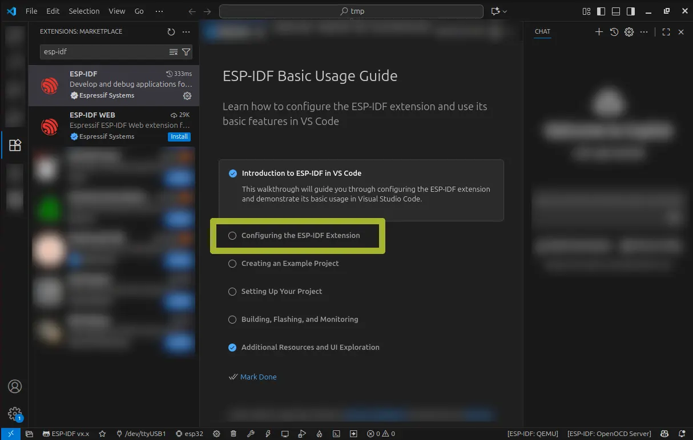
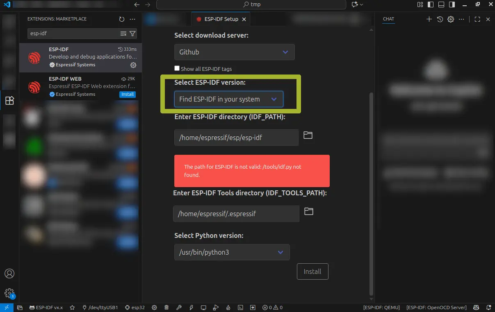
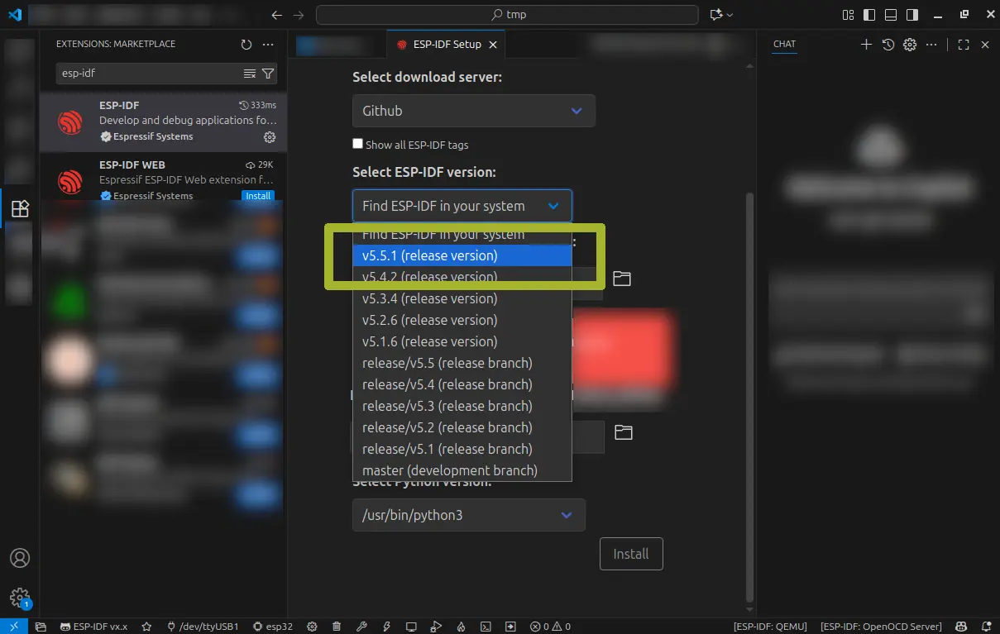
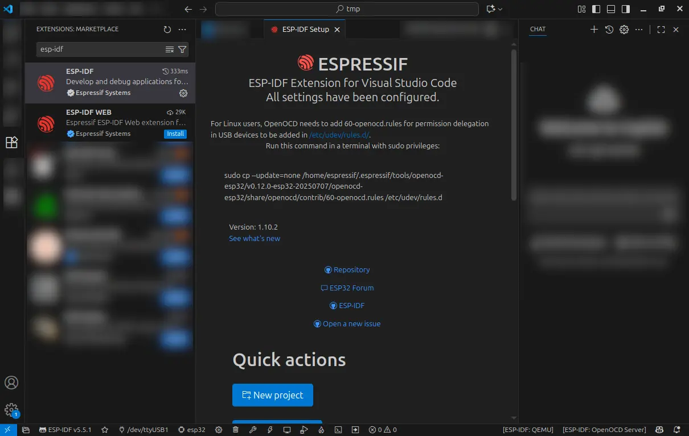
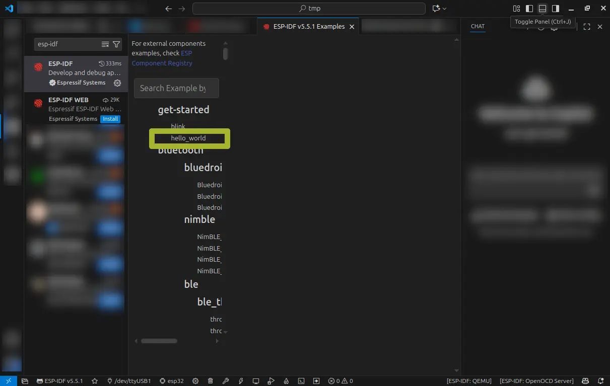
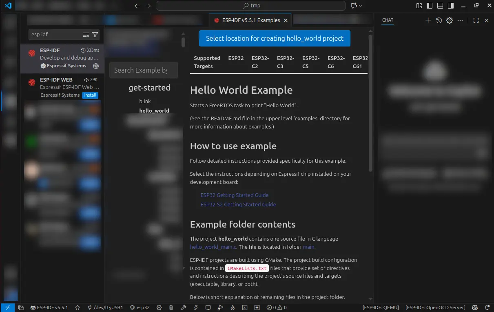
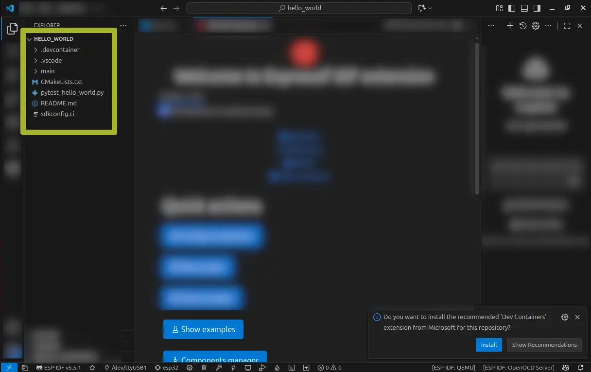
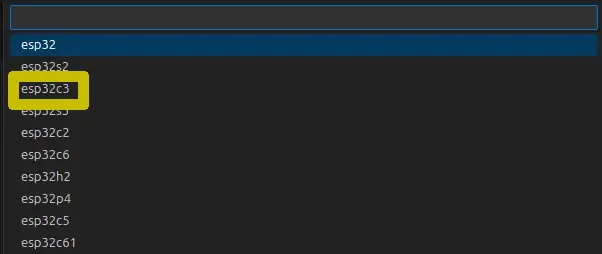

# Guida setup ambiente

## Introduzione

In questa guida vedremo come impostare l'ambiente di sviluppo per poter lavorare a progetti basati su toolchain ESP-IDF. 

Nel seguito useremo l'IDE open source [VS Code](https://code.visualstudio.com/) e l'_estensione ESP-IDF per VS Code_, che permette sia di configurare la tool chain che di compilare e di programmare la memoria flash dei moduli Espressif. 

Se non hai a disposizione una EVK Espressif, puoi comunque testare tutti i passi riportati in questa guida tranne l'ultimo. 

Per l'ultimo step, è necessario invece un EVK basato su un qualunque SoC Espressif. Durante il workshop verrà consegnata una scheda basata su `ESP32-C3`, la [`ESP32-C3-DevKit-RUST-1`](https://github.com/esp-rs/esp-rust-board?tab=readme-ov-file#rust-esp-board). 


>[!NOTE]
> Il termine ESP-IDF compare sia per indicare la [toolchain](https://github.com/espressif/esp-idf?tab=readme-ov-file#espressif-iot-development-framework) vera e propria che l'[estensione per VS Code](https://github.com/espressif/vscode-esp-idf-extension?tab=readme-ov-file#esp-idf-extension-for-vs-code). In questa guida verrà esplicitamente indicata come _toolchain ESP-IDF_ la prima ed _estensione ESP-IDF_ la seconda. 

La guida è strutturata divisa in 5 parti:
1. Installazione di VS Code e dei prerequisiti
2. Installazione dell'estensione ESP-IDF per VS Code
3. Configurazione della toolchain ESP-IDF
4. Compilazione primo progetto
5. Programmazione del modulo 

## Installazione VS Code e prerequisiti

Questo passo dipende dal tuo sistema operativo, segui la guida appropriata qui sotto. 

&#x1F427; Linux: [Installazione VS Code e prerequisiti](Installation_linux.md) <br>
&#x1FA9F; Windows: [Installazione VS Code](Installation_windows.md) <br>
&#x1F34E; macOS: [Installazione VS Code e prerequisiti](Installation_macos.md) <br>


## Installazione dell'estensione per VS Code 

Una volta installati tutti i prerequisiti, possiamo aggiungere l'estensione ESP-IDF a VS Code. Attraverso l'__estensione__ ESP-IDF, installeremo e configureremo poi la __toolchain__ ESP-IDF. 

* Apri VS Code
* Individua l'icona delle estensioni (quattro quadrati) sulla sinistra

* Cerca nel riquadro `esp-idf`

* Clicca il tasto "Install" sul primo risultato `ESP-IDF`
  * Se richiesto, clicca su "Accetta e installa" 

## Configurazione della toolchain ESP-IDF

Una volta installata l'estensione ESP-IDF, va eseguita la procedura di configurazione che permetterà di installare l'intera toolchain ESP-IDF automaticamente. 

* Clicca su `Configuring the ESP-IDF Extension`


>[!WARNING]
> Se non si è aperta automaticamente la pagina di configurazione dell'estensione, puoi:
> * Aprire la palette dei comandi (`F1` oppure `CTRL+SHIFT+P`)
> * Digitare:<br>
>    `> ESP-IDF: Configure ESP-IDF Extension`

* Si aprirà un nuovo tab &rarr; Clicca su `EXPRESS`

* Apri il menù a tendina `Select ESP-IDF version`

* Selezione l'opzione `5.5.1 (release version)`

* Clicca su `Install`

* Attendi che l'installazione sia finita. 

> [!NOTE]
> L'installazione può richiedere parecchio tempo. 
* Al termine dell'installazione troverai la schermata di conferma


## Compilazione del primo progetto

Una volta installata l'estensione e la toolchain, è il momento di testare la compilazione di un progetto. Per fare questo, creeremo un nuovo progetto a partire da uno degli esempi inclusi con la toolchain ESP-IDF. 

### Crea un progetto da un esempio

* Apri la command palette (`F1` o `CTRL+SHIFT+P`)
* Inizia a digitare `ESP-IDF: Show Example Project` e clicca sull'opzione che compare sotto sotto. 

* Si apre un menù a tendina &rarr; Seleziona la versione `ESP-IDF v5.51`

* Si apre un tab con una lista di progetti &rarr; Seleziona `hello_world`

* Nel tab centrale  si apre la descrizione del progetto
* Clicca su `Select location for creating hello_world project`

* Si apre la finestra di selezione &rarr; scegli una cartella dove creare il progetto e premi `Select this folder`<br>
* Si apre ora una nuova finestra di VS Code
* Nel riquadro a destra, dovresti ora vedere i file del progetto basato sull'esempio `hello_world`.

> [!NOTE]
> Se non vedi i file, assicurati che sia selezionata la prima icona sulla sinistra (i due fogli sovrapposti).

### Specificare il target

Per poter compilare il progetto e programmare il modulo Espressif, è necessario indicare al compilatore con quale SoC si desidera procedere (chiamato "target"). Nel workshop, useremo una scheda basata su ESP32-C3, quindi per l'installazione indicheremo questo target. 

> [!TIP]
> Se hai a disposizione un'altra EVK, scegli il target corrispondente. 

* Nella palette dei comandi (`F1` o `CTRL+SHIFT+P`) digita `ESP-IDF: Set Espressif Device Target`

* Nel menù a tendina che compare &rarr; seleziona `esp32c3`

* Nel menù a tendina seguente &rarr; seleziona `ESP32-C3 chip (via builtin USB-JTAG)`


### Compilare il progetto

Passiamo ora alla compilazione del progetto. 

* Apri la palette dei comandi (`F1` o `CTRL+SHIF+P`)

* Inizia a digitare `ESP-IDF: Build Your Project`


* A questo punto si apre un terminale in basso e compaiono i messaggi di compilazione
* Alla fine della compilazione, vedrai il riassunto della memoria richiesta


Se vedi la schermata di riassunto, significa che sia la toolchain che l'estensione sono state correttamente installate. 

Se hai a disposizione una EVK Espressif, puoi procedere ora con la sezione successiva. Qui verificheremo che la connessione USB sia operativa. 

## Programmazione del modulo (flash)

Una volta compilato il progetto, è il momento di programmare il modulo. 
L'estensione ESP-IDF per VS Code mette a disposizione il comando `> ESP-IDF: Flash (UART) Your Project`. 

In generale però, il comando che viene più utilizzato è il seguente
```console
> ESP-IDF: Build, Flash and Start a Monitor on Your Device
```

Oltre a compilare il progetto e programmarlo sul dispositivo, questo comando inizializza un monitor, ossia ti permette di leggere la seriale del modulo direttamente sul terminale dell'editor. 

Per programmare il modulo, bisogna

1. Selezionare la porta a cui è collegata l'EVK
2. Programmare il modulo e far partire un monitor<br>
   `> ESP-IDF: Build, Flash and Start a Monitor on Your Device`


>[!NOTE]
> In Linux potresti aver bisogno di aggiungere l'utente al gruppo `dialout` per poter usare la seriale senza i privilegi di admin. Da terminale, digita:
>```
>sudo usermod -a -G dialout $USER
>```
> Ricordati di chiudere la sessione (log out) e riaprine una per rendere attive le modifiche. 


### Selezionare la porta a cui è collegata l'EVK

* Connetti la scheda con un cavo USB alla porta del tuo computer
* Se l'avevi chiuso, riapri VS Code e apri la cartella del progetto
  * `File`&rarr; `Open Folder` oppure  `File`&rarr; `Open Recent`
* Apri la palette dei comandi e digita:<br> 
   `>ESP-IDF: Select Port to Use (COM, tty, usbserial)`

* Seleziona la porta (Silicon Labs - il produttore del ponte USB/UART a bordo dell'EVK)

* Il nome della porta ora appare nella barra in basso


>[!WARNING]
> Se il sistema operativo non rileva automaticamente la scheda connessa alla porta USB, consulta la guida corrispondente:
> * &#x1FA9F; [Windows](https://docs.espressif.com/projects/esp-idf/en/stable/esp32/get-started/establish-serial-connection.html#check-port-on-windows)
> * &#x1F427; [Linux](https://docs.espressif.com/projects/esp-idf/en/stable/esp32/get-started/establish-serial-connection.html#check-port-on-linux-and-macos)
> * &#x1F34E; [macOS](https://docs.espressif.com/projects/esp-idf/en/stable/esp32/get-started/establish-serial-connection.html#check-port-on-linux-and-macos)

### Programmare il modulo e far partire un monitor

* Apri la palette dei comandi e digita:<br>
   `> ESP-IDF: Build, Flash and Start a Monitor on Your Device`

* Nel menù a tendina &rarr; seleziona UART

* Attendi che il modulo venga programmato e che parta il monitor
* Nel terminale dell'editor, vedrai i messaggi di boot e l'"hello world!"


Se riesci a vedere il messaggio nel terminale, significa che il tuo setup è operativo e sei pronto per il workshop e per lavorare a progetti basati su ESP-IDF.  

## Conclusione

In questa guida abbiamo visto come installare VS Code, l'estensione ESP-IDF e la toolchain di ESP-IDF. Abbiamo visto come creare un progetto, compilarlo e programmare il modulo sull'EVK. 
L'ambiente di sviluppo è ora pronto. 
