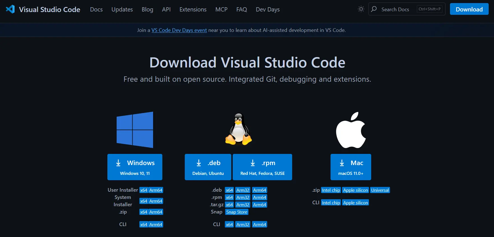
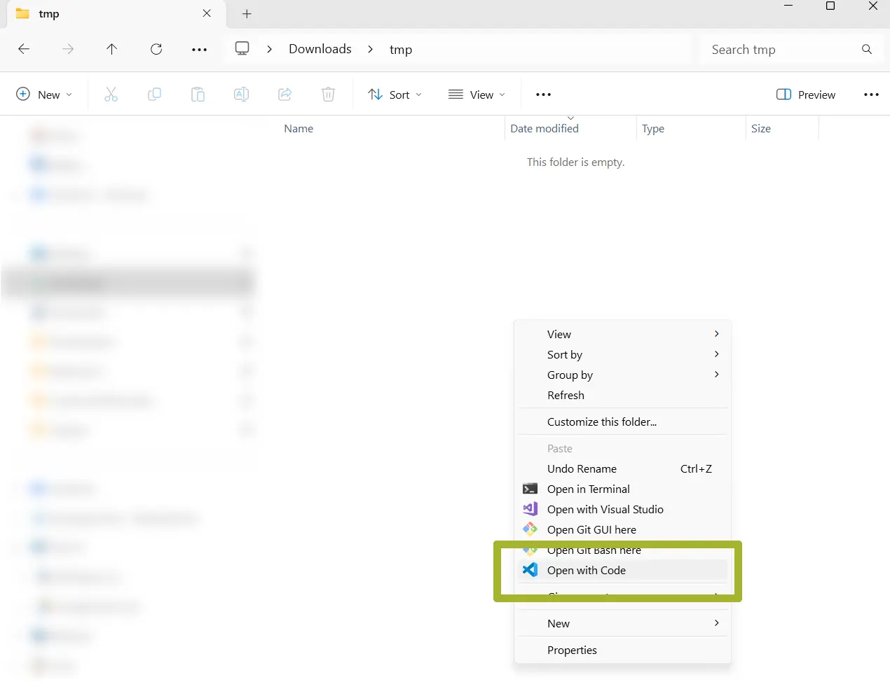
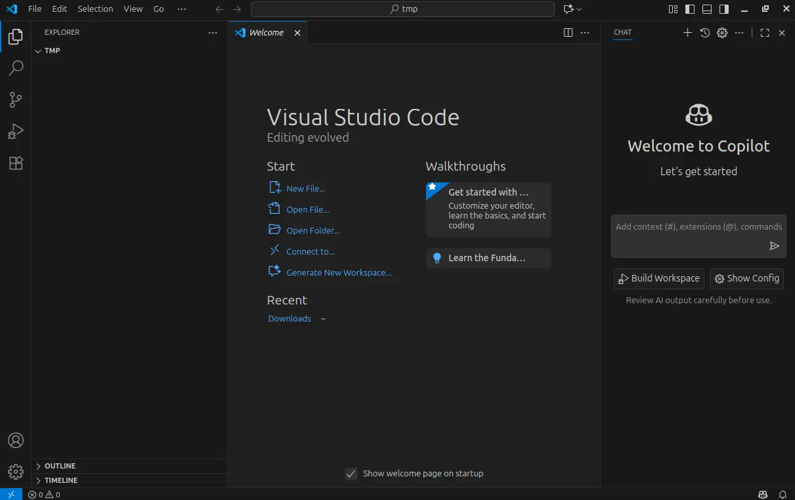

# &#x1FA9F; Installazione VS Code e prerequisiti - Windows

## Installazione VS Code

* Vai su [sito di download di VS Code](code.visualstudio.com/downloads)
* Scarica ed installa la versione per Windows

>[!WARNING]
> In questa guida viene usato Windows 11 

* Una volta scaricato il file `.exe`, fai doppio click e segui la procedura di installazione

Finita l'installazione, per aprire VS Code ci sono due strade. 

1. Apri VS Code da menù
2. Apri VS Code da una cartella

Siccome è spesso utile aprire l'editor direttamente nella cartella, seguiremo questa seconda strada. 

#### Apri VS Code da una cartella

* Crea una nuova cartella `tmp`
* Clicca tasto destro del mouse all'interno della cartella in Explorer
* Sul menù seleziona `Show more options`
* Clicca su `Open with Code`

* Dovresti ora vedere l'interfaccia di VS Code

>[!NOTE]
> VS Code potrebbe chiedervi se vi fidate dell'autore della cartella. Questo aspetto è importante quando vengono usate repo `git`, per il momento non fa differenza. Clicca "Sì". 

## Installazione prerequisiti

Non ci sono da installare altri prerequisiti. Questi sono infatti gestiti automaticamente durante la configurazione dell'estensione ESP-IDF.

## Prossimi step

> Prosegui con il [prossimo passo](README.md#installazione-dellestensione-per-vs-code).
