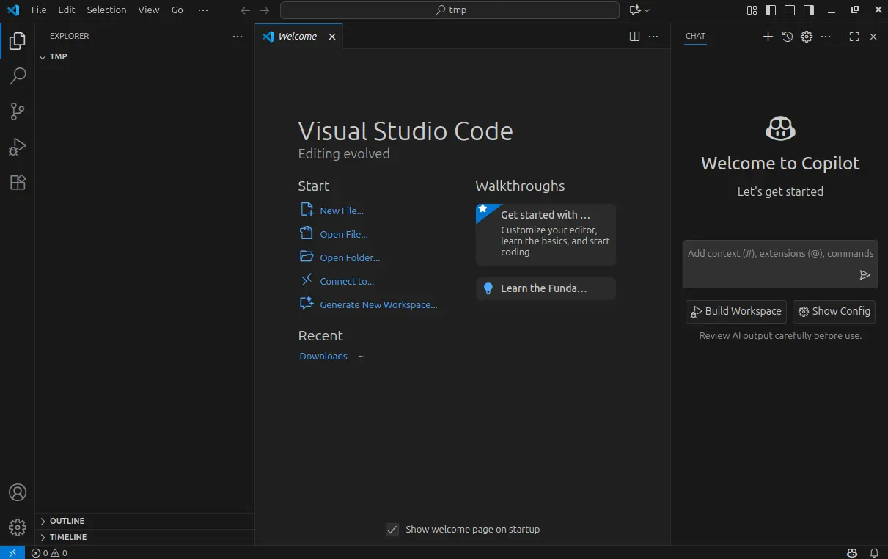

# &#x1F34E; Installazione VS Code e prerequisiti - macOS

## Installazione VS Code

* Vai su [sito di download di VS Code](code.visualstudio.com/downloads)
* Scarica ed installa la versione per macOS 


>[!WARNING]
> In questa guida viene usata macOS Sequoia. 

* Una volta scaricato il file, installa VS Code
* Clicca `CTRL+SPACE` e cerca `Code`. Clicca sull'icona di VS Code
* Dovresti ora vedere l'interfaccia di VS Code




>[!NOTE]
> Quando apri una cartella in VS Code, potrebbe apparire un pop-up che ti chiede se ti fidi dell'autore della cartella. Questo aspetto è importante quando vengono usate repo `git`, per il momento non fa differenza. Clicca "Sì". 


## Installazione prerequisiti

Per poter __installare__ e configurare la toolchain ESP-IDF, è necessario avere già installati Python e git. 
Nel seguito si userà il gestione pacchetti [homebrew](https://brew.sh/) (`brew`). 

__Installazione homebrew__

Per installare homebrew:
* Apri un terminale
* Digita:<br>
   ```console
   /bin/bash -c "$(curl -fsSL https://raw.githubusercontent.com/Homebrew/install/HEAD/install.sh)"
   ```

### Python

La toolchain ESP-IDF usa la versione di sistema di python. 
Puoi verificare la versione di python digitando sul terminale
```console
python 3 --version
``` 

> [!NOTE]
> Nel caso python non fosse già presente, puoi installarlo col seguente comando da terminale:
> ```
>brew install python3
>```

### `git`

Lo sviluppo di ESP-IDF è basato su [`git`](https://git-scm.com/), il tool di controllo di versione usato, tra gli altri anche per lo sviluppo del kernel Linux. `git` è la base su cui si fonda GitHub. 

Per installare git:
* Apri un terminale 
* Installa `git`:<br> 
   ```
   sudo brew install git
   ```
* Controlla che git sia stato installato correttamente:<br>
  ```console
  > git --version
  > git version 2.43.0
  ```

### Installazione prerequisiti

Per __utilizzare__ la toolchain ESP-IDF, è necessario installare i tool rimanenti. 

* Apri un terminale
* Digita:<br>
   ```console
   brew install cmake ninja dfu-util
   ````

Durante il processo di installazione, potresti aver incontrato dei problemi. Fai riferimento alla sezione [Troubleshooting](#troubleshooting) per vedere l'errore riscontrato rientra nella casistica indicata. 

## Prossimi step

> Prosegui con il [prossimo passo](README.md#installazione-dellestensione-per-vs-code).

---
## Troubleshooting

Durante il processo di installazione potresti incontrare alcuni errori comuni.
Di seguito sono riportati i più frequenti con la relativa causa e soluzione.


### Xcode Command Line Tools non installati

**Errore**

```console
xcrun: error: invalid active developer path (/Library/Developer/CommandLineTools), 
missing xcrun at: /Library/Developer/CommandLineTools/usr/bin/xcrun
```

**Causa**
I tool da riga di comando di Xcode non sono installati o non correttamente configurati.

**Soluzione**

```console
xcode-select --install
```

### Toolchain non trovata (`xtensa-esp32-elf`)

**Errore**

```console
WARNING: directory for tool xtensa-esp32-elf version esp-2021r2-patch3-8.4.0 is present, but tool was not found
ERROR: tool xtensa-esp32-elf has no installed versions. Please run 'install.sh' to install it.
```

**Causa**
Su macOS con architettura Apple Silicon, alcuni strumenti binari richiedono Rosetta 2 per funzionare.

**Soluzione**

```console
/usr/sbin/softwareupdate --install-rosetta --agree-to-license
```

### Errore “Bad CPU type in executable”

**Errore**

```console
zsh: bad CPU type in executable: ~/.espressif/tools/xtensa-esp32-elf/esp-2021r2-patch3-8.4.0/xtensa-esp32-elf/bin/xtensa-esp32-elf-gcc
```

**Causa**
L’eseguibile richiede Rosetta 2 per poter essere eseguito su sistemi macOS M1/M2/M3.

**Soluzione**

```console
/usr/sbin/softwareupdate --install-rosetta --agree-to-license
```